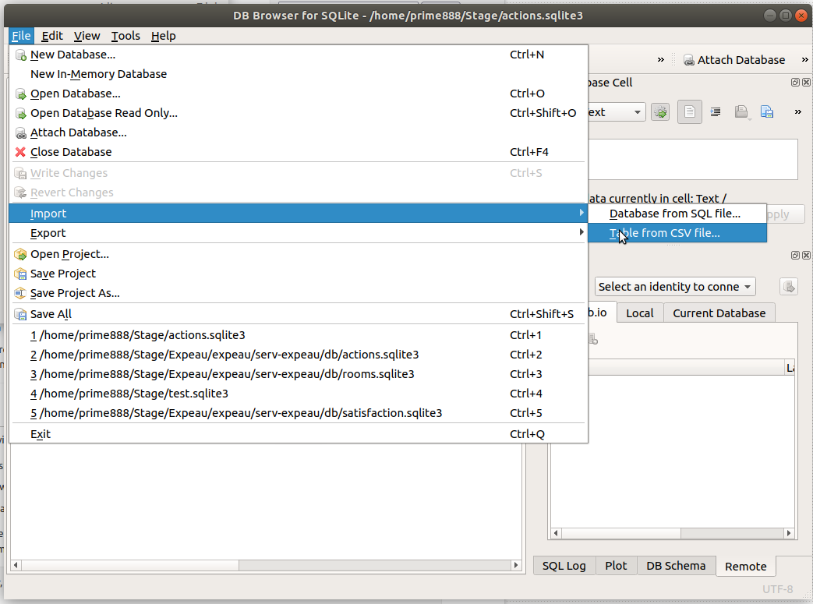
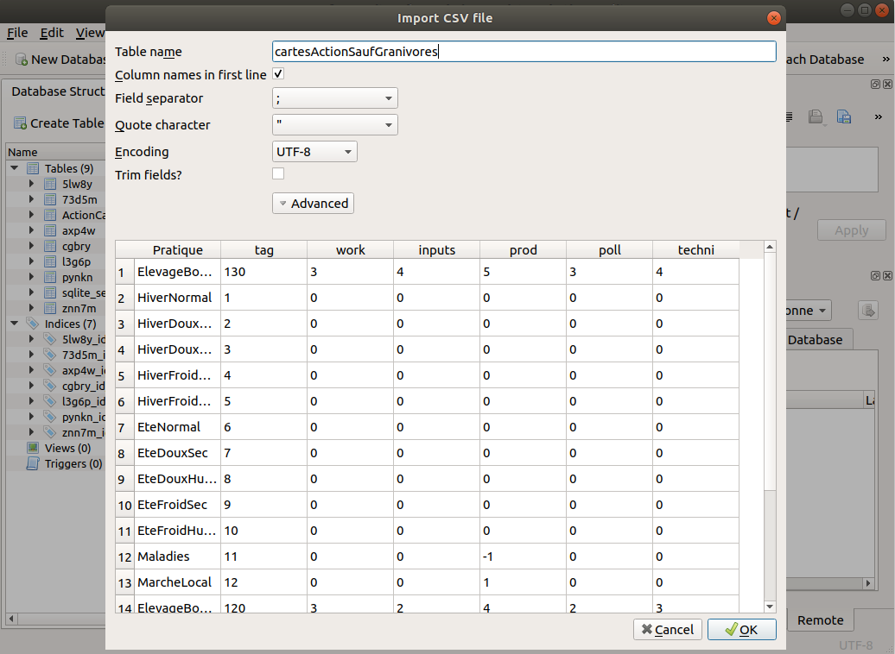
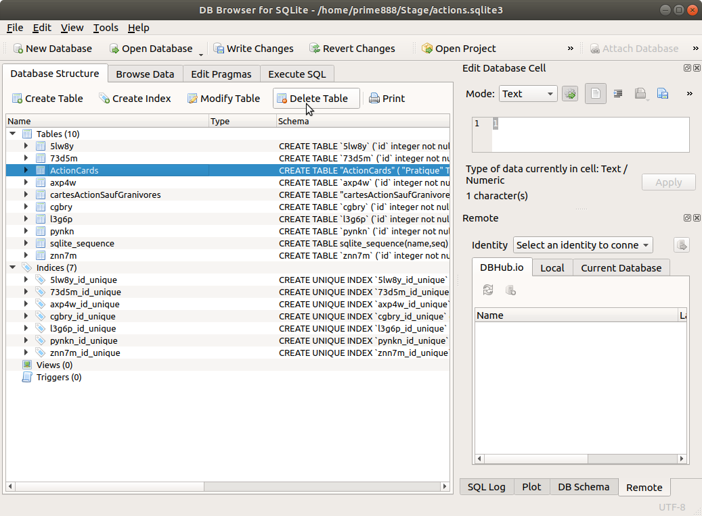

# Exp'eau
## Partie client
Au début du projet nous avons travailler les 2 sur le problème de création de grille de jeu pour l’interface du client. Tout d’abord nous avons décidé d’utiliser react pour l’application de client. Ce Framework sur js a beaucoup des outils intéressant pour notre but. Donc les différents composant qui permettent de faciliter la création et customisation de grille ont été testé. J’ai trouvé une de ces outils très efficace et fait un prototype qui construise la grille à partir des coordonnées prédéfinis. Ce composant permet également de changer les couleurs et ajouter facilement des figures ce qui correspond bien à nos besoins.  La suite de cette partie a été géré par Hugo. J’ai commencé à travailler sur la partie serveur d’application.

### Menu principale
Par contre plus tard je suis revenu pour créer le menu principal. Son but est de proposer à un joueur la possibilité de créer et rejoindre le lobby de jeu. 

**Fonctionalités**

- [x] Creation du lobby
- [x] Joindre le lobby
- [x] List dynamique des joueurs
- [x] Dubut de partie
- [x] Design
- [x] Rejoindre le lobby en cours en cas deconnection

## Partie serveur
Le but de serveur et de récupérer l’information des clients, la regrouper, lancer le simulateur et renvoyer au joueurs l’information mise a jour. En plus il gère donc la création des lobbies et le déroulement des parties. Le serveur sauvegarde également les logs des actions des joueurs. 
Tout au début j’ai considéré plusieurs solutions pour mettre ça en place. L’idée initiale été de faire un serveur html avec une base de données à cote. Je n’ai pas trop aimé cette solution parce que les clients sont donc besoin d’envoyer les requetés au serveur chaque N secondes pour savoir s’il y a des mises a jour. J’ai vu que pour des projets similaires on utilise souvent les sockets. Les sockets permettent d’établir la connexion entre le serveur et le client et de transmettre l’information vers 2 cotes. 

Pour le choix de Framework j’ai décidé de rester sur node.js parce que d’après mes recherches sur les projets similaires ça marche très bien en pair avec le react. En plus j’ai pu trouver un Framework sur node.js qui facilite énormément la création et gestion des sockets qui s’appelle Socket.io.

Le serveur a pas mal de responsabilités, donc je les regroupe par leurs rôles :

**Partie**
- [x] Creation de lobby pour une partie de jeu
- [x] Joindre une lobby
- [ ] Reconnexion a une partie en cours
- [x] Start d'une partie
- [x] Gestion des tours
- [x] Envoi de list des joueurs dans le lobby

**Joueurs**
- [x] Attribution des pseudos aux joueurs
- [x] Initialisation de leur stats (ut, ub)
- [x] Renvoi des stats sur demande ou sur leur modification

**Grille**
- [x] Creation de grille separe dans la bdd pour chaque nouvelle partie
- [x] Envoi de grille mise a jour a tout les joueurs dans une partie
- [x] Envoi des cases necessaires a un joueur qui le demande

**Actions**
- [x] Creation de bdd avec les actions des joueurs a chaque nouvelle partie
- [x] Reception et srockage d'actions
- [ ] Transformation de cet bdd en logs sous format csv a la fin du partie
- [x] Ajout des actions envoyes par les joueurs
- [x] Recuperation des action d'un joueur demandes d'un tour demande
- [x] Stockage et envoi des cartes d'actions

**Simulateur**

Le but de cette partie et de créer une interface permettant l’échange d’informations entre le serveur et un simulateur quelconque, qui respecte le format des donnes d’entrée et de sortie. L’idée est de mettre toutes les actions d’un tour dans le fichier, appeler le simulateur a la fin de tour ; le simulateur va mettre à jour la grille et les stats des joueurs dans l’autre fichier, le serveur va attendre dès qu’il finit à travailler à envoyer la nouvelle information aux joueurs.
- [x] Mettre les action sous un bon format dans le fichier
- [x] Appeler le simulateur
- [x] Attendre les modifications
- [x] Les envoyer aux joueurs

Il faudra trouver une bon moyen de regrouper les  fichiers des actions et de grille, vu qu'il peuvent vite creer le disordre sur le serveur.

### Developpement
Construction de serveur a pris beaucoup des essaies et des erreurs. Il y a encore des bugs qui se retrouvent parfois et demandes des fixes. Ce n’est pas possible de tout prévoir d’un coup en plus avec tellement peu d’expérience dans ces questions. 

Par contre, en cours de développement j’ai décidé d’utiliser une pratique connue de TDD (test-driven development). Elle consiste à créer un programme de test qui va jouer le rôle de client dans notre cas et comparer les donnes issues de serveur avec les donnes attendus tapés manuellement. Ici, cette pratique m’a permis de gagner pas mal de temps car la partie de client est développé au même moment que la partie serveur et donc pas toutes les fonctionnalités sont près de deux côtes au même temps. 

J’ai décidé d’utiliser le Framework Mocha qui supporte node.js et a une documentation riche sur internet. En plus, j’ai eu déjà un peu d’expérience avec ce Framework.

## Base de donnes
Les bases de données sont stockées dans la répertoire serv-expeau/db/

Ils sont stockés en format .sqlite3 . Le logiciel **DB Browser for SQLite** permet d’ouvrir et de modifier ces bdd.

Chaque fichier bdd peut contenir plusieurs tables.
Les bases suivants sont présents: 

### grid
stock la grille initiale dans table **Grid**. Une grille courant pour chaque partie est stockée dans table **code partie**. Cette dernière table est utilisée pour produire les fichiers roundX.txt pour le simulateur.

### actions
stock les cartes d’actions dans table **ActionCards**. Les actions des joueurs sont stockés dans la table **code partie**. Les données de cette table sont appliquées à la fin de tour à Grille courant de partie pour modifier les actions en place.

### players
stock l’information sur les joueurs pour une partie en cours dans table **code partie**

### rooms
stock les information nécessaire pour la reconnection a la partie en cas de crash de serveur. Ces données se trouve dans la table **Rooms**

### satisfaction
stock la satisfaction des joueurs pour chaque partie dans la table **code partie**

### Modification des scénario à partir des fichiers csv

Exemple de modification pour les cartes d’actions:

1. Ouvrir la bdd des actions avec sqlitebrowser

2. Comparer le format des données dans le fichier csv et dans l’ancien table : noms de colonnes, leur ordre, etc

3. Importer le fichier csv en tant qu’une table

4. Choisir le bon séparateur et cocher **Columns name in the first line**

5. Supprimer ou renommer l’ancien table **ActionCards**

6. Renommer la nouvel table généré à partir de csv en **ActionCards** (Choisir la table et appuyer sur la bouton **Modify table**)

